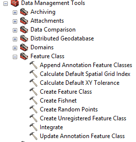
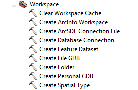

name: inverse
layout: true
class: center, middle, inverse
---
# arcpy-specific functions
---
layout: false
## Overview

1. `arcpy.Exists()`

2. `arcpy.Describe()`

3. `arcpy.SpatialReference` (class)

4. `arcpy.Field` (class)

5. Listing Data

6. Creating Workspaces and Data

7. Copying Existing Data
---
template: inverse
## arcpy.Exists() 
---
## arcpy.Exists()

- Check to see if a dataset exists

- Like `os.path.exists()`, but can follow non-file system paths,
  e.g., `D:\Data\Infrastructure.gdb\EastValley\powerlines`

- Also can follow paths relative to a workspace

- Returns a boolean indicating existance

```py
>>> import arcpy

# check an absolute path
>>> arcpy.Exists(r"D:\Data\Infrastructure.gdb\EastValley\powerlines")
True

# check a path relative to a defined workspace
>>> arcpy.env.workspace = r"D:\Data\Infrastructure.gdb"

>>> arcpy.Exists(r"EastValley\Powerlines")
True
```
---
template: inverse
## arcpy.Describe()
---
## arcpy.Describe()

- Gets a dataset's properties

- Available properties vary between data types

- Returns a Describe object, which contains the dataset's properties

- All Describe objects have a basic set of properties:

```py
>>> desc = arcpy.Describe(r"D:\Data\Infrastructure.gdb\EastValley\powerlines")

>>> desc.catalogPath
u'D:\\Data\\Infrastructure.gdb\\EastValley\\powerlines'

>>> desc.baseName
u'powerlines'

>>> desc.dataType
u'FeatureClass'

>>> desc.dataElementType
u'DEFeatureClass'
```
---
## arcpy.Describe()

- A Feature Class returns a dataType of `FeatureClass`

- [Feature Class properties](http://resources.arcgis.com/en/help/main/10.2/index.html#/FeatureClass_properties/018v00000011000000/)
  are a subset of
  [Table Properties](http://resources.arcgis.com/en/help/main/10.2/index.html#/Table_properties/018v0000003m000000/)
  and
  [Dataset Properties](http://resources.arcgis.com/en/help/main/10.2/index.html#/Dataset_properties/018v00000065000000/)

```py
# FeatureClass properties
>>> desc.featureType
u'Simple'

>>> desc.shapeType
u'Polygon'

# Dataset properties
>>> desc.SpatialReference
<geoprocessing spatial reference object object at 0x122BF158>

# Table properties
>>> desc.hasOID
True

>>> desc.fields
[<geoprocessing describe field object object at 0x122BF9C8>, <geoprocessing desc
ribe field object object at 0x122BF9F8>, <geoprocessing describe field object ob
ject at 0x122BF8A8>, <geoprocessing describe field object object at 0x122BFB00>,
 <geoprocessing describe field object object at 0x122BF728>]
```
---
template: inverse
## arcpy.SpatialReference (class)
---
## arcpy.SpatialReference (class)

- A [Spatial Reference](http://resources.arcgis.com/en/help/main/10.2/index.html#/SpatialReference/018z0000000v000000/)
  (SR) represents a geographic or coordinate reference system (GRS or CRS)

- Get the SR of a dataset using arcpy.Describe():

```py
>>> sr = desc.spatialReference

>>> sr.name
u'USA_Contiguous_Albers_Equal_Area_Conic_USGS_version'

>>> sr.type
u'Projected'

# this doesn't work becasue this is only set on GCSs
>>> sr.GCSName
u''

# but getting the SR of the GCS and asking it does
>>> sr.GCS.GCSName  # could alternatively get sr.GCS.name
u'GCS_North_American_1983'

>>> sr.factoryCode
102039

>>> sr.centralMeridian
-96.0
```
---
## arcpy.SpatialReference (class)

- SR objects can be gotten from data, or constructed:

```py
# create an SR from a name
>>> sr2 = arcpy.SpatialReference("Alaska Albers Equal Area Conic")

>>> sr2.name
u'NAD_1983_Alaska_Albers'


# create an SR from a WKT code
>>> sr3 = arcpy.SpatialReference(102039)

>>> sr3.name
u'USA_Contiguous_Albers_Equal_Area_Conic_USGS_version'


# load SR from a .prj file
>>> sr4 = arcpy.SpatialReference

>>> sr4.createFromFile("USA_albers_USGS.prj")

>>> sr4.name
u'USA_Contiguous_Albers_Equal_Area_Conic_USGS_version'

# continued on next slide
```
---
## arcpy.SpatialReference (class)

```py
# load SR from a prj string
>>> prj = sr.exportToString()

>>> prj
u"PROJCS['USA_Contiguous_Albers_Equal_Area_Conic_USGS_version',GEOGCS['GCS_North
_American_1983',DATUM['D_North_American_1983',SPHEROID['GRS_1980',6378137.0,298.
257222101]],PRIMEM['Greenwich',0.0],UNIT['Degree',0.0174532925199433]],PROJECTIO
N['Albers'],PARAMETER['False_Easting',0.0],PARAMETER['False_Northing',0.0],PARAM
ETER['Central_Meridian',-96.0],PARAMETER['Standard_Parallel_1',29.5],PARAMETER['
Standard_Parallel_2',45.5],PARAMETER['Latitude_Of_Origin',23.0],UNIT['Meter',1.0
]];-16901100 -6972200 10000;-100000 10000;-100000 10000;0.001;0.001;0.001;IsHigh
Precision"

>>> sr5 = arcpy.SpatialReference()

>>> sr5.loadFromString(prj)

>>> sr5.name
u'USA_Contiguous_Albers_Equal_Area_Conic_USGS_version'
```
---
template: inverse
## arcpy.Field (class)
---
## arcpy.Field (class)

- [Field objects](http://resources.arcgis.com/en/help/main/10.2/index.html#/Field/018z0000004n000000/)
  represent the column in a table

- Accessed by the Describe and ListFields functions

- Changing field properties in a dataset cannot be done using Field objects

```py
>>> fields = desc.fields

>>> fields[0].name
u'OBJECTID'

>>> fields[0].type
u'OID'

>>> fields[0].length
4

>>> fields[0].precision
0

>>> fields[0].isNullable
False

>>> fields[0].editable
False
```
---
template: inverse
## Listing Data
---
## Listing Data

- acrpy provides functions to list the following:
    - [Datasets](http://resources.arcgis.com/en/help/main/10.2/index.html#/ListDatasets/03q30000001z000000/)
    - [Feature Classes](http://resources.arcgis.com/en/help/main/10.2/index.html#/ListFeatureClasses/03q300000023000000/)
    - [Fields](http://resources.arcgis.com/en/help/main/10.2/index.html#/ListFields/03q30000001t000000/)
    - [Files](http://resources.arcgis.com/en/help/main/10.2/index.html#/ListFiles/03q300000018000000/)
    - [Indicies](http://resources.arcgis.com/en/help/main/10.2/index.html#/ListIndexes/03q300000041000000/)
    - [Rasters](http://resources.arcgis.com/en/help/main/10.2/index.html#/ListRasters/03q30000005m000000/)
    - [Tables](http://resources.arcgis.com/en/help/main/10.2/index.html#/ListTables/03q300000042000000/)
    - [Versions](http://resources.arcgis.com/en/help/main/10.2/index.html#/ListVersions/03q300000012000000/)
    - [Workspaces](http://resources.arcgis.com/en/help/main/10.2/index.html#/ListWorkspaces/03q30000004z000000/)

- Most will list data of that type in the current workspace
---
## Listing Data

- `arcpy.ListFeatureClasses()` will list FCs in a workspace

- Can take `wild_card`, `feature_type` and `feature_dataset` arguments to limit returned results

- Returns a list of feature class names

```py
>>> arcpy.env.workspace = r"D:\Data\Geodatabase.gdb"

>>> arcpy.ListFeatureClasses()
[u'Pointfc', u'Polylinefc', u'Polygonfc', u'Annotationfc']

>>> arcpy.ListFeatureClasses("p*")  # FCs that start with "p"
[u'Pointfc', u'Polylinefc', u'Polygonfc']

>>> arcpy.ListFeatureClasses(feature_type="Annotation")
[u'Annotationfc']

# what about data in a feature dataset?
# first need to find the feature datasets
>>> arcpy.ListDatasets()
[u'electric', u'water']

>>> arcpy.ListFeatureClasses(feature_dataset="water")
[u'mains', u'valves', u'hydrants', u'prvs', u'pumps']
```
---
## Listing Data

- `arcpy.ListRasters` lists raster data in a workspace

- Supports `wild_card` and `raster_type` arguments

- Returns list of rasters

- `os.listdir()` or `glob` could be used to get rasters in folder,
  but `ListRasters()` is easier when wanting all types
    
    - Also necessary when rasters are stored in a GDB
---
## Listing Data

- `arcpy.ListTables` returns list of all tables in a workspace

- Supports `wild_card` and `table_type` arguments

- Will not list files like .cvs or .xlsx formats

- Again, necessary if files stored in GDB
---
## Listing Data

- `arcpy.ListFiles()` will list files in a workspace

- Supports `wild_card` argument

- Don't see much good this does over `os.listdir()`

    - `ListFiles` in a GDB workspace lists the literal files makeing up the GDB
---
## Listing Data

- `acrpy.ListWorkspaces()` lists workspaces in a workspace
    - Huh?

- Supports `wild_card` and `workspace_type` parameters

- Workspaces types are:

    - `Access`: personal geodatabase

    - `Covereage`: coverage workspace

    - `FileGDB`: file geodatabase

    - `Folder`: a generic file system folder

    - `SDE`: ArcSDE database

    - `All`: all of the above; the default
---
## Listing Data

- Two listing functions are not like the other ones:
    
    - `arcpy.ListFields()`

    - `arcpy.ListIndexes()` (who named this one?)

- Both take a feature class as an argument

- `ListFields()` supports `wild_card` and `field_type` parameters

- `ListIndexes()` supports a `wild_card` argument

```py
>>> featureclass = arcpy.ListFeatureClasses(feature_dataset="water")[0]
# this is the mains feature class

# want all integer fields
>>> fields = arcpy.ListFields(featureclass, field_type="Integer")

>>> fields += arcpy.ListFields(featureclass, field_type="SmallInteger")

>>> for field in fields:
...     print field.name
Diameter
Age
Condition
```
---
## Listing Data

- One more not like the others: `arcpy.ListVersions()`

- Takes an SDE workspace as the argument

- Returns a list of version names the current user has persmissions to use
---
## Listing Data: An Example

**Problem:**

We have a folder containing a bunch of GIS data, including a few geodatabases.
We want to find all the numerical fields in all the feature classes in all the geodatabases.
The geodatabases may have feature datasets.

What do we do?
---
## Listing Data: An Example

```py
import os
import arcpy
from arcpy import env

# set workspace to folder
folder = "C:\Data"
env.workspace = folder

# we never said we were limited to File GDBs; get Personal GDBs
geodatabases = arcpy.ListWorkspaces(workspace_type="Access")

# add File GDBs to the list
geodatabases += arcpy.ListWorkspaces(workspace_type="FileGDB")

# continued on next slide
```
---
## Listing Data: An Example

```py
# create blank list for found fields
numericfields = []

# iterate through geodatabases
for gdb in geodatabases:
  env.workspace = os.path.join(folder, gdb)
  featuredatasets = arcpy.ListDatasets()
  featuredatasets.append("")    

  # iterate through datasets in gdb and get fcs
  for fds in featuredatasets:
    featureclasses = arcpy.ListFeatureClasses(feature_dataset=fds)

    # iterate through feature class in fds and get fields
    for fc in featureclasses:
      fields = arcpy.ListFields(fc, field_type="Double")
      fields = arcpy.ListFields(fc, field_type="Integer")
      fields = arcpy.ListFields(fc, field_type="SmallInteger")
        
      for field in fields:
        # add the field to the list with the full path to the fc in a tuple
        numericfields.append((os.path.join(folder, gdb, fds, fc), field.name))

print numericfields
```
---
template: inverse
## Creating Workspaces and Data
---
## Creating Workspaces and Data

- Many desktop workflows require creating new workspaces and/or datasets

    - Need a new GDB to store relevant layers

    - Adding a new set of features to a database in a new feature class

- Can't just right-click in catalog...
---
## Creating Workspaces and Data

- [Tools are available in the toolbox](http://resources.arcgis.com/en/help/main/10.2/index.html#/A_quick_tour_of_geoprocessing_tool_references/002t0000000z000000/):

    
    
---
## Creating Workspaces and Data

- We can call toolbox tools from python

- Name of python function is `arcpy.` + `NameOfToolWithoutSpaces` + `_toolboxname`

```py
>>> import arcpy

# call the create file gdb tool; out_version is optional
>>> gdb = arcpy.CreateFlieGDB_management(r"C:\GIS\Data", "MyNewGDB",
                                         out_version="CURRENT")

# now we want a new feature class
# need a spatial reference object first
>>> sr = arcpy.SpatialReference(4326)  # EPSG 4326 is WGS84 GCS

>>> arcpy.CreateFeatureClass_management(gdb, "NewFC", "POLYGON",
                                        has_z="ENABLED",
                                        spatial_reference=sr)
```
---
template: inverse
## Copying Existing Data
---
## Copying Existing Data

- arcpy has multiple copy functions:

    - `arcpy.Copy_management()`

    - `arcpy.CopyFeatures_management()`

    - `arcpy.CopyRaster_management()`

    - `arcpy.CopyRasterCatalog_managmeent()`

    - `arcpy.CopyRows_management()`

- Choosing `Copy` vs. one of the others is not alway clear

    - If you get an error, try a different approach
---
## Copying Existing Data: An Example

**Problem:**

We have a bunch of old data in shapefiles, organized in folders, that we want to get into geodatabases.
Each folder in the current organizational structure should be reporduced as a new geodatabase.
For each of the existing shapefiles we also need to create a new blank feature class 
with the shapefile's attribute schema, but a new spatial reference (we have OR North NAD83 HARN in Intl Feet,
we want it in Meters). The copied feature classes and new feature classes need to be separated in the new
geodatabases for organizational purposes.

What do we do?
---
## Copying Existing Data: An Example

```py
import os
import arcpy
from arcpy import env

originaldata = [r"D:\Power\Lines",
                r"D:\Power\Stations",
                r"D:\Power\Transformers"]

newlocation = r"D:\Power\GDBs"

# WKID 2838 is OR N NAD83 HARN Meters
newcrs = arcpy.SpatialReference(2838)

# same as above, but Intl Feet
oldcrs = arcpy.SpatialReference(2913)

# continued on next slide
```
---
## Copying Existing Data: An Example

```py
# iterate through existing folders
for folder in originaldata: 
  
  # create new gdb and feature datasets
  newgdbname = os.path.basename(folder)
  newgdb = arcpy.CreateFileGDB_management(newlocation, newgdbname)
  newfds = arcpy.CreateFeatureDataset_management(newgdb, "NEW", newcrs)
  oldfds = arcpy.CreateFeatureDataset_management(newgdb, "OLD", oldcrs)

  # get a list of fcs in existing gdb
  env.workspace = folder
  fcs = arcpy.ListFeatureClasses()

  # iterate through fcs, copy and create new
  for fc in fcs:
    geometrytype = arcpy.Describe(fc).shapeType

    # copy original fc to oldfds with name fc
    copiedfc = arcpy.CopyFeatures_management(fc, os.path.join(oldfds, fc))
    
    # new fc with geometry type and template of copiedfc, SR is newcrs
    arcpy.CreateFeatureClass_management(newfds, fc, geometrytype,
                                        template=copiedfc,
                                        spatial_reference=newcrs)
```
